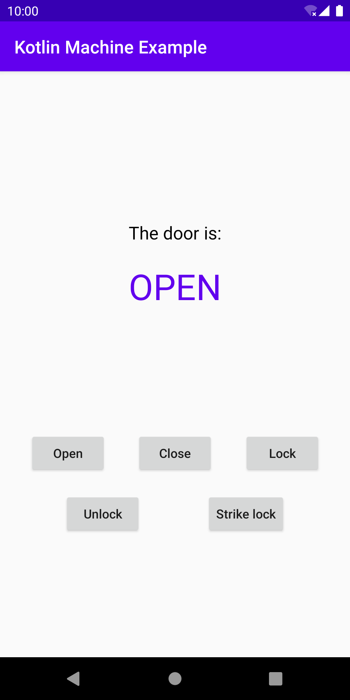

# kotlin-machine
[](https://jitpack.io/#mirceabucerzan/kotlin-machine)

A Kotlin library that makes expressing [finite-state machines](https://en.wikipedia.org/wiki/Finite-state_machine) painless.

## Download
This library is published on [JitPack](https://jitpack.io/).

### Gradle
Add the JitPack maven URL to your project's root `build.gradle` file:
```gradle
allprojects {
    repositories {
        ...
        maven { url 'https://jitpack.io' }
    }
}
```
Add the library dependency to your module's `build.gradle` file:
```gradle
dependencies {
    implementation 'com.github.mirceabucerzan:kotlin-machine:1.0.0-alpha01'
}
```

### Maven
Add JitPack to the repositories section of your `pom.xml`:
```xml
<repository>
  <id>jitpack.io</id>
  <url>https://jitpack.io</url>
</repository>
```
Add the library dependency to your `pom.xml`:
```xml
<dependency>
  <groupId>com.github.mirceabucerzan</groupId>
  <artifactId>kotlin-machine</artifactId>
  <version>1.0.0-alpha01</version>
</dependency>
```

## API
It is declarative and straightforward to use. Begin by defining the states and inputs. Don't forget to provide working implementations for `equals()` and `hashCode()`.

```kotlin
sealed class DoorState(private val id: Int) {
    class Open : DoorState(0)
    class Closed : DoorState(1)

    override fun equals(other: Any?): Boolean {
        if (this === other) return true
        if (other !is DoorState) return false
        if (id != other.id) return false
        return true
    }

    override fun hashCode(): Int = id
}
```
```kotlin
sealed class DoorInput(private val id: Int) {
    class Close : DoorInput(0)
    class Open : DoorInput(1)

    override fun equals(other: Any?): Boolean {
        if (this === other) return true
        if (other !is DoorInput) return false
        if (id != other.id) return false
        return true
    }

    override fun hashCode(): Int = id
}
```

Next, use the `Provider` class and define the `Transition`s:
```kotlin
val transitions: Set<Transition<DoorState, DoorInput>> = setOf(
    Provider.provideTransition<DoorState, DoorInput>(
        // from the 'Open' state
        state = DoorState.Open(),
        // transition to the 'Closed' state
        nextState = DoorState.Closed(),
        // if the 'Close' input is triggered
        input = DoorInput.Close(),
        // and execute the 'output' function as a side effect
        output = { input -> println("Output function called with input: $input") }
    ),
    Provider.provideTransition<DoorState, DoorInput>(
        state = DoorState.Closed(),
        nextState = DoorState.Open(),
        input = DoorInput.Open(),
        output = { input -> println("Output function called with input: $input") }
    )
)
```

And finally, with the `Provider`'s abstract builder, build the `StateMachine`:
```kotlin
val stateMachine: StateMachine<DoorState, DoorInput> =
    Provider.provideBuilder<DoorState, DoorInput>().run {
        addInitialState(DoorState.Open())
        addState(DoorState.Closed())
        addTransitions(transitions)
        build()
    }
```

Optionally, add final states by calling the `addFinalState()` and `addFinalStates()` methods.

Now the `StateMachine` is ready for processing inputs, which will cause the appropriate transitions to be triggered:
```kotlin
val newState: DoorState = stateMachine.process(DoorInput.Close()) // transition to the 'Closed' state
```

To enable logging, the following flag needs to be set before anything else (by default it is `false`):
```kotlin
StateMachine.LOGGING_ENABLED = true
```

## Example Android app
For something closer to a real-world usage scenario, check out the example Android application in the `app` module:

<div>
  
</div><br>

It is intentionally implemented as simply as possible, no fancy MVVM or MVP, just an `Activity` displaying a `Door`'s state while allowing user inputs to be sent to it. The `Door` implementation uses a `StateMachine` for processing inputs.

## License
Licensed under the [MIT License](LICENSE).
```
MIT License

Copyright (c) 2020 Mircea Bucerzan

Permission is hereby granted, free of charge, to any person obtaining a copy
of this software and associated documentation files (the "Software"), to deal
in the Software without restriction, including without limitation the rights
to use, copy, modify, merge, publish, distribute, sublicense, and/or sell
copies of the Software, and to permit persons to whom the Software is
furnished to do so, subject to the following conditions:

The above copyright notice and this permission notice shall be included in all
copies or substantial portions of the Software.

THE SOFTWARE IS PROVIDED "AS IS", WITHOUT WARRANTY OF ANY KIND, EXPRESS OR
IMPLIED, INCLUDING BUT NOT LIMITED TO THE WARRANTIES OF MERCHANTABILITY,
FITNESS FOR A PARTICULAR PURPOSE AND NONINFRINGEMENT. IN NO EVENT SHALL THE
AUTHORS OR COPYRIGHT HOLDERS BE LIABLE FOR ANY CLAIM, DAMAGES OR OTHER
LIABILITY, WHETHER IN AN ACTION OF CONTRACT, TORT OR OTHERWISE, ARISING FROM,
OUT OF OR IN CONNECTION WITH THE SOFTWARE OR THE USE OR OTHER DEALINGS IN THE
SOFTWARE.
```
